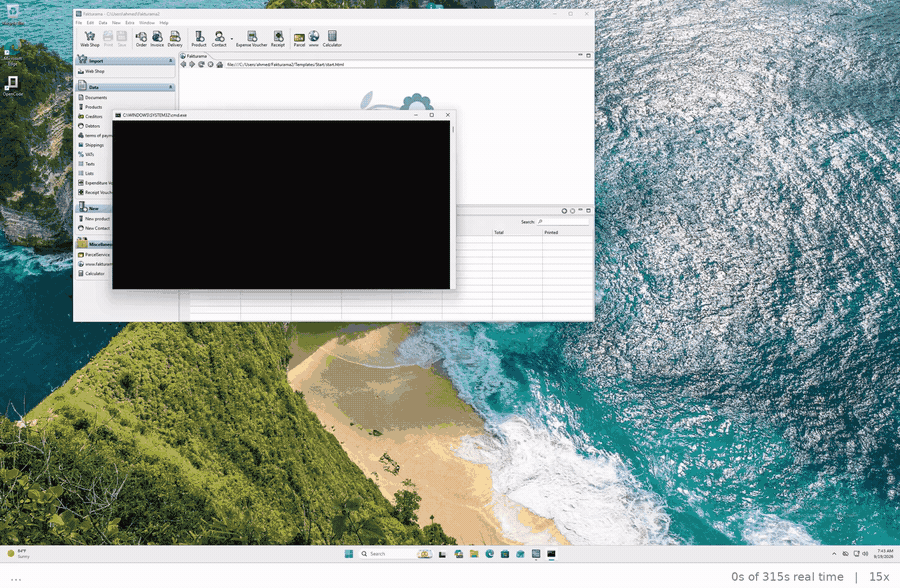
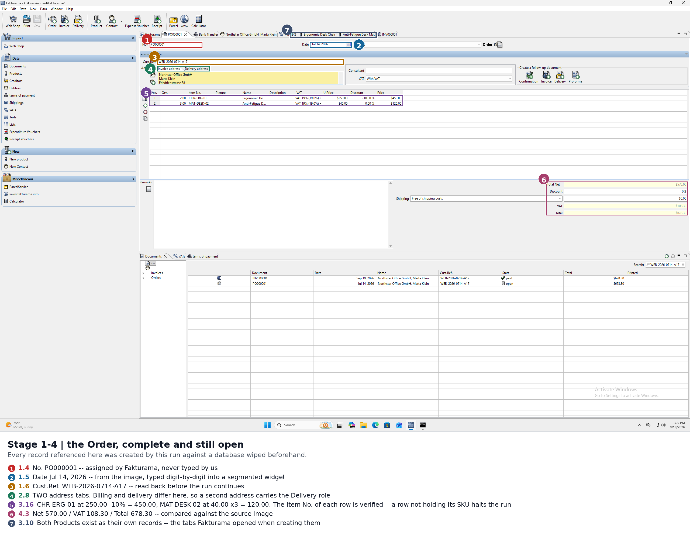
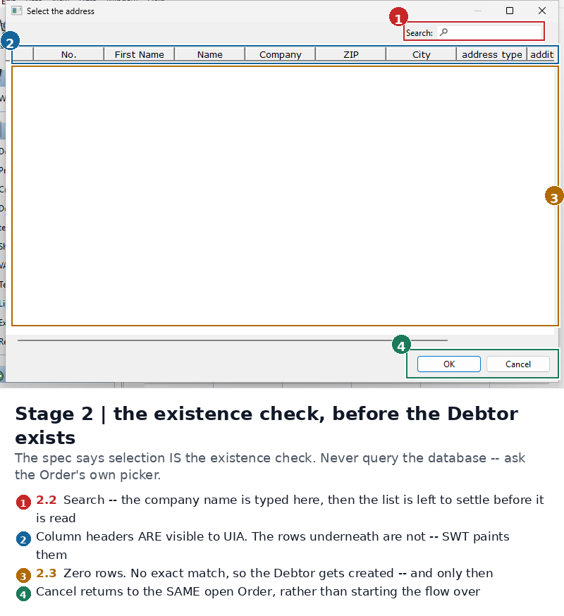
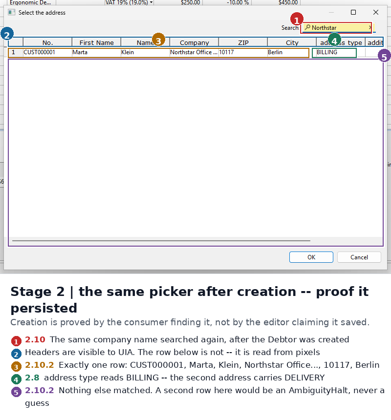

# Fakturama Image-to-Cash

**One order image in. One saved, verified Order and its linked Invoice out.**



*A full run. 35 clicks, 316 seconds of real time at 15×, every click marked where it
landed with the spec step it belongs to. Also as
[mp4](docs/recording.mp4), a [1× cut](docs/recording-realtime.mp4), and a
[folder of frames](docs/film/).*

## Deliverables

| Asked for | Here |
|---|---|
| **Part 1 — design doc**, 1–4 pages, no code | **[DESIGN-BRIEF.pdf](DESIGN-BRIEF.pdf)** — 1 page, the whole argument · **[DESIGN.pdf](DESIGN.pdf)** — 4 pages, the full version<br>Markdown: [DESIGN-BRIEF.md](DESIGN-BRIEF.md) · [DESIGN.md](DESIGN.md) |
| **Source code with a clear structure in a Git repo** | [Where everything is](#where-everything-is) — `src/` (6 modules), `tests/`, `tools/`, `input/`, `docs/` |
| **Setup instructions: dependencies and how to run** | **[Setup](#setup-dependencies-and-how-to-run)** — 4 steps. Dependencies are `pywinauto`, `Pillow`, `rapidocr-onnxruntime` in [requirements.txt](requirements.txt). [Commands](#commands) has the commands and flags. |
| **Annotated screenshots or a short recording** | **both** — [10 annotated screenshots](docs/screenshots/), [35 annotated frames](docs/film/), and a [22-second clip with every click marked](docs/recording.mp4) |
| **README** | this file |
| **Written question — if I had 3 more hours** | [last section](#written-question----if-i-had-3-more-hours) |

Every one of the spec's **57 numbered steps** runs and is traceable in the code by its
number. Search `src/flow.py` for `2.10.2` or `3.16` and you will land on the line that
implements it.

## What it does



The automation reads a sales-order image, opens a New Order in Fakturama, resolves the
Debtor and every Product through the Order's **own selectors**, creates whatever master
data is missing, returns to the same open Order, saves it, creates the linked Invoice
through the follow-up action, applies the paid status, and verifies both saved records.

No hardcoded screen coordinates. Nothing assumed about window size, theme or DPI.

> The interesting part is not clicking. It is deciding, at each step, whether what I am
> looking at is the thing I meant — and stopping when I cannot tell.

## Where everything is

```
fakturama-image-to-cash/
├── README.md              you are here — setup, results, limitations, written answer
├── DESIGN-BRIEF.md / .pdf  Part 1, one page
├── DESIGN.md / .pdf        Part 1, full version, four pages
├── requirements.txt       3 packages, all Windows-only markers
├── .env.example           the provider chain, with placeholders
│
├── input/
│   ├── order.png              the source document
│   ├── order.json             replay cache, so --cached runs with no API key
│   └── order.extracted.json   what was read, and what will be done with it
│
├── src/                   extract → flow → driver, 6 modules
├── tests/                 31 checks, run anywhere: python3 tests/test_extract.py
├── tools/                 first_run, annotate, film, video, storyboard, timeline, bench
│
└── docs/
    ├── WALKTHROUGH.md         the guided tour, glossary first
    ├── FINDINGS.md            what the application turned out to be
    ├── BENCHMARK.md           which reader reads the grids, measured
    ├── TIMING.md              where a run's 316 seconds go
    ├── run-log-complete.txt   full trace of one clean run
    ├── screenshots/           10 annotated + the diagnostics behind FINDINGS
    ├── film/                  35 annotated frames, one per click
    ├── raw/                   the unretouched captures the annotations come from
    ├── recording.mp4          22 s at 15×, every click marked
    └── recording-realtime.mp4 260 s at 1×
```

### Reading it in ten minutes

| Order | File | Why |
|---|---|---|
| 1 | [`docs/recording.mp4`](docs/recording.mp4) | 22 seconds — watch it work |
| 2 | [`docs/screenshots/01-order-complete.png`](docs/screenshots/01-order-complete.png) | the result, with callouts mapped to spec steps |
| 3 | [`DESIGN.md`](DESIGN.md) | why it is built this way |
| 4 | [`src/flow.py`](src/flow.py) | the five stages, readable next to the task PDF |
| 5 | [`docs/FINDINGS.md`](docs/FINDINGS.md) | the seven bugs that wrote wrong data with no error |

### Also included, not asked for

| | |
|---|---|
| [docs/WALKTHROUGH.md](docs/WALKTHROUGH.md) | a guided tour that assumes no prior context, glossary first |
| [docs/FINDINGS.md](docs/FINDINGS.md) | what the application turned out to be, found by running it — including seven bugs that wrote wrong data with no error |
| [docs/BENCHMARK.md](docs/BENCHMARK.md) | which reader should read the grids, measured rather than asserted |
| [docs/TIMING.md](docs/TIMING.md) | where a run's 316 seconds go, and one optimisation tried and reverted |
| [docs/recording-realtime.mp4](docs/recording-realtime.mp4) | the same run at 1×, for watching rather than skimming |

---

## Result

A run ends with a verdict, not a wall of log lines:

```
==========================================================================
================ DONE - Order and linked Invoice verified ================
==========================================================================
  Order       saved and found in Data > Documents, still open
  Invoice     linked, paid 2026-07-18, 678.30 EUR
  Cust.Ref.   WEB-2026-0714-A17
  Totals      net 570.00 / VAT 108.30 / gross 678.30
  Lines       CHR-ERG-01 x2, MAT-DESK-02 x3
  Elapsed     316s
==========================================================================
  exit 0
```

|                 |                                                                                                                                         |
| --------------- | --------------------------------------------------------------------------------------------------------------------------------------- |
| Repeatable      | repeated clean-database runs produce this identical result                                                                              |
| "Clean" means   | the workspace **and** `%USERPROFILE%\.fakturama2` deleted first — so every master record was created by the run that reports it |
| Created per run | payment method, Debtor, two addresses, VAT rate, two Products                                                                           |
| Checked where   | the HSQLDB, not only on screen                                                                                                          |

Read back out of `Data > Documents` at the end of a run
([`05-documents-verified.png`](docs/screenshots/05-documents-verified.png)):

| Document      | Date         | Cust.Ref.             | State          | Total  |
| ------------- | ------------ | --------------------- | -------------- | ------ |
| `INV000001` | Sep 19, 2026 | `WEB-2026-0714-A17` | **paid** | 678.30 |
| `PO000001`  | Jul 14, 2026 | `WEB-2026-0714-A17` | **open** | 678.30 |

The Order carries the *extracted* order date (1.5) while the Invoice takes today's
(5.1), and the source Order remains open beside its paid Invoice (5.5).

And in the database itself:

| Table                        | Row                                                                                             |
| ---------------------------- | ----------------------------------------------------------------------------------------------- |
| `FKT_ADDRESS_CONTACTTYPES` | `BILLING` → Friedrichstrasse 88, 10117 Berlin                                                |
| `FKT_ADDRESS_CONTACTTYPES` | `DELIVERY` → Beusselstrasse 44, 10553 Berlin                                                 |
| `FKT_DOCUMENTITEM`         | `CHR-ERG-01` *Ergonomic Desk Chair*, −10% · `MAT-DESK-02` *Anti-Fatigue Desk Mat*, 0% |
| `FKT_DOCUMENT`             | `Order` and `Invoice`, both `WEB-2026-0714-A17`, both 678.30                              |
| `FKT_PAYMENT`              | code `30` — the UNTDID 4461 code for a credit transfer                                        |

### Evidence

The picker before the Debtor exists, and after it was created — same dialog, same query:

| | |
|---|---|
|  |  |

That pair is the whole argument for proving persistence by re-selecting rather than
trusting the editor's own "saved" state.


| What                                                        | Where                                                         |
| ----------------------------------------------------------- | ------------------------------------------------------------- |
| full trace, elapsed time per step                           | [`docs/run-log-complete.txt`](docs/run-log-complete.txt)     |
| what was read from the image, and what will be done with it | [`input/order.extracted.json`](input/order.extracted.json)   |
| ten annotated screenshots, callouts mapped to spec steps    | [`docs/screenshots/`](docs/screenshots/)                     |
| the run as 35 annotated frames                              | [`docs/film/`](docs/film/)                                   |
| a 22-second clip at 15×, clicks marked                     | [`docs/recording.mp4`](docs/recording.mp4)                   |
| the same run at 1×, for seeing where the time goes         | [`docs/recording-realtime.mp4`](docs/recording-realtime.mp4) |
| which reader reads the grids, measured                      | [`docs/BENCHMARK.md`](docs/BENCHMARK.md)                     |
| where the 316 seconds go, measured                          | [`docs/TIMING.md`](docs/TIMING.md)                           |
| what the application turned out to be                       | [`docs/FINDINGS.md`](docs/FINDINGS.md)                       |

---

## Setup: dependencies and how to run

### Dependencies

| Package | For | Note |
|---|---|---|
| `pywinauto` | UI Automation | Windows only |
| `Pillow` | screenshots and annotation | Windows only |
| `rapidocr-onnxruntime` | local OCR — grid geometry, and the no-key fallback | Windows only |

All three carry `sys_platform == "win32"` markers in
[requirements.txt](requirements.txt), so `pip install -r requirements.txt` installs
nothing on Linux or macOS and the offline tests still run there. Python 3.10+.

### Commands

```bash
git clone https://github.com/ahmedislamfarouk/fakturama-image-to-cash.git
cd fakturama-image-to-cash
cp .env.example .env          # then paste a key into .env

python -m src.run input/order.png --extract-only   # any OS, no Fakturama
pip install -r requirements.txt                    # Windows, for the full flow
python -m src.run input/order.png
```

| Flag                   | Does                                                                                        |
| ---------------------- | ------------------------------------------------------------------------------------------- |
| *(none)*             | extract, then drive Fakturama end to end                                                    |
| `--extract-only`     | read the image and validate it; touch no UI                                                 |
| `--cached`           | replay `input/order.json` instead of calling a model — runs the whole UI flow with no key |
| `--attach`           | drive an already-running Fakturama instead of launching one                                 |
| `--film`             | save a numbered frame after every click                                                     |
| `--record`           | capture the screen throughout, for `tools/video.py`                                        |
| `--fakturama <path>` | if the executable is not at the default location                                            |

| Exit  | Means                                                             |
| ----- | ----------------------------------------------------------------- |
| `0` | Order and linked Invoice saved and verified                       |
| `2` | `AmbiguityHalt` — stopped for manual review, with a screenshot |
| `3` | the image failed its own arithmetic twice; nothing was typed      |

### Vision providers

Numbered env groups, tried in order. Limits apply per model **and** per account, so the
chain fails over across both. Measured, not assumed: [`docs/BENCHMARK.md`](docs/BENCHMARK.md).

| # | Provider                     | Model                                  | Cost               | Measured                                           |
| - | ---------------------------- | -------------------------------------- | ------------------ | -------------------------------------------------- |
| 1 | **Google Gemini**      | `gemini-3.5-flash-lite`              | free tier, no card | **1,075 ms**, all columns and values correct |
| 2 | OpenRouter                   | `inclusionai/ling-3.0-flash-vl:free` | free, ~50/day      | 26,158 ms, correct                                 |
| 3 | a second account of either   | —                                     | —                 | a third bucket                                     |
| 4 | **local `rapidocr`** | —                                     | none, offline      | 1,218 ms, but merged two columns on one grid       |

Adding a provider is an env edit: `LLM_BASE_URL_2`, `LLM_API_KEY_2`, `LLM_MODELS_2`.
Tier 4 needs no key at all, so the automation still runs with none of the above filled in.

### Checking what was read out of the image

| File in `input/`        | Is                                         | Written by                          |
| ------------------------ | ------------------------------------------ | ----------------------------------- |
| `order.png`            | the input document                         | given                               |
| `order.json`           | a replay **cache** — raw fields only | the extractor, on success           |
| `order.extracted.json` | the **validation view**               | every run, before the UI is touched |

The cache answers *what did it read*. The validation view answers the question a human
actually has: *what is it about to do with that*.

| Field in the validation view                  | Why it is there                                                                                               |
| --------------------------------------------- | ------------------------------------------------------------------------------------------------------------- |
| `checks.arithmetic` + `identities`        | the four sums, with their numbers, pass or fail                                                               |
| `line_net_recomputed` / `line_net_agrees` | the image's stated line total against ours                                                                    |
| `product_master_gross` + note               | `250.00 × 1.19 = 297.50`. The **line** discount must not touch it (3.9) — `267.75` would be wrong |
| `delivery_same_as_billing` + `step_2_8`   | decides whether the Delivery role goes on the Main address or a second one (2.8)                              |

Those last two are invisible in the raw fields and both are easy to get backwards, which
is why they are stated in words rather than left to be inferred.

### Running it against Fakturama (Windows)

| # | Step                                  | Note                                                                                                                                                                             |
| - | ------------------------------------- | -------------------------------------------------------------------------------------------------------------------------------------------------------------------------------- |
| 1 | Install Fakturama                     | [https://www.fakturama.info/download/](https://www.fakturama.info/download/)                                                                                                      |
| 2 | `pip install -r requirements.txt`   | `pywinauto`, `Pillow`, `rapidocr-onnxruntime` — all marked `sys_platform == "win32"`, so the same file installs nothing on Linux and the offline tests still run there  |
| 3 | `python tools\first_run.py`         | Fakturama's first launch shows an initialization dialog *before* the main window exists. This accepts the defaults so the workspace and database get created. Once per machine. |
| 4 | `python -m src.run input/order.png` | add `--fakturama "<path>"` if it is not at the default location                                                                                                                 |

**Resetting between runs has two traps**, both worth knowing before you try it:

| Trap                                                                                | Why                                                                                                                                                                                                           |
| ----------------------------------------------------------------------------------- | ------------------------------------------------------------------------------------------------------------------------------------------------------------------------------------------------------------- |
| Delete **both** `%USERPROFILE%\Fakturama2` and `%USERPROFILE%\.fakturama2` | the "already initialised" flag lives in the second one and survives deleting the workspace *and* reinstalling the MSI. Miss it and Fakturama refuses a New Order with "No default value found for Shippings" |
| Kill `Fakturama`, not `Fakturama2`                                               | a running instance holds `Database.lck`, so a reset that kills the wrong process name silently deletes nothing and the next run starts dirty while looking clean                                             |

---

## How it is put together

```
order.png ──▶ extract ──▶ OrderData ──▶ flow ──▶ driver ──▶ Fakturama
              (vision +   (validated,   (the 5    (UIA, 4-tier
               arithmetic) Decimal)      stages)   grounding)
```

| File                      | Lines | Role                                                                                 |
| ------------------------- | ----- | ------------------------------------------------------------------------------------ |
| `src/extract.py`        | 267   | image → validated `OrderData`. Pure; no GUI, no Windows.                           |
| `src/driver.py`         | 1347  | UIA primitives, the 104-entry selector registry, waiting, grid reading, screenshots. |
| `src/flow.py`           | 796   | the five stages, transcribed with spec step numbers in comments.                     |
| `src/vision.py`         | 255   | the provider chain, the T4 tiebreak, and reading custom-painted grids.               |
| `src/ocr.py`            | 152   | local OCR: measures column spans and row centres.                                    |
| `src/run.py`            | 122   | CLI, env loading, exit codes.                                                        |
| `tests/test_extract.py` | 119   | 23 assertions. No pytest needed.                                                     |

`python3 tests/test_extract.py` → `ok - 23 checks passed`

### Control discovery

Fakturama is Eclipse RCP/SWT. On Windows it renders native Win32 widgets, so UIA sees a
real tree — but SWT sets almost no `AutomationId`, and names are locale-derived.

Four tiers, first unambiguous hit wins:

| Tier | Method                                                                    | Buys                                                                 |
| ---- | ------------------------------------------------------------------------- | -------------------------------------------------------------------- |
| T1   | tree search **scoped to the active window**                          | "Save" means *this Order's* Save                                    |
| T2   | anchor-relative walk — find the `Addresses` label, take the nth sibling | "the upper icon, not the lower green +" as tree position, not pixels |
| T3   | tooltip / help-text disambiguation                                        | separates identical siblings                                         |
| T4   | an LLM shown a screenshot of **the anchor's own UIA rectangle**      | the model picks *which*; UIA still supplies *where*               |

T2 is the answer to "no hardcoded coordinates" — ordering is a property of the widget
hierarchy, so resize, DPI and theme changes survive. Verified: full runs at both
1024×768 and 2560×1600, same code.

**Waiting** is a polled, UIA-observed postcondition after every action — never a fixed
delay standing in for a check. There are 18 `time.sleep` calls left, all settles after
a relayout, each followed by the poll or read-back that actually decides.

### Exit codes

| Code | Meaning                                                                                                     |
| ---- | ----------------------------------------------------------------------------------------------------------- |
| 0    | Order and linked Invoice saved and verified                                                                 |
| 2    | `AmbiguityHalt` — the spec said stop for manual review; a screenshot is written to `docs/screenshots/` |
| 3    | extraction failed arithmetic validation twice                                                               |

---

## Correctness

The source document is self-checking, so extraction correctness is decidable without a
human. Every read is gated on four identities before a single click happens:

```
line_net  == qty × unit_net × (1 − disc/100)
net_total == Σ line_net
vat_total == Σ (line_net × vat/100)
gross     == net_total + vat_total
```

On the supplied image: `2×250×0.90 = 450.00`, `3×40 = 120.00`, `Σ = 570.00`,
`19% = 108.30`, `gross = 678.30`. A failure re-prompts once naming the broken
identity, then halts. Money is `Decimal` throughout — never `float`.

### Three rules that are easy to get backwards

Each has a test and a step-numbered comment.

| Step          | Rule                                                                                                                                                     | Right                       | Wrong                                                                                               |
| ------------- | -------------------------------------------------------------------------------------------------------------------------------------------------------- | --------------------------- | --------------------------------------------------------------------------------------------------- |
| **3.9** | Product master price is `unit_net × (1 + vat/100)`. The *line* discount must not touch it                                                            | `297.50`                  | `267.75`                                                                                          |
| **2.8** | Delivery role goes on the Main address **only if** billing == delivery. Here they differ (Friedrichstrasse 88 / 10117 vs Beusselstrasse 44 / 10553) | a second address carries it | unconditional shortcut → wrong Debtor                                                              |
| **5.3** | if not PAID, invent no date or value. If PAID, the date and amount are **read back out of the Invoice**                                             | halt on mismatch            | this step once printed `ok` from what it meant to write, while the Invoice saved with the run date |

### Ambiguity halts

|         |                                                                                 |
| ------- | ------------------------------------------------------------------------------- |
| Steps   | 2.3, 2.10.2, 3.3, 3.5, 3.12, 5.2                                                |
| Shape   | more than one exact candidate, or one whose properties conflict with the source |
| Carries | the logical control, the query, the candidates seen, a screenshot               |
| Why     | guessing between two Debtors is the one failure this must never produce         |

Every stage is check → create → re-select, so a second run finds the master data
already present and skips creation.

---

## Verified against Fakturama 2.2.0

The selector registry started as guesses from the spec's figures. Every one has since
been checked against a live UIA tree — Windows 11 Pro VM, Fakturama 2.2.0 with bundled
JRE. The guesses that were wrong:

| Logical                | Guessed               | Actually                             |
| ---------------------- | --------------------- | ------------------------------------ |
| `toolbar.order`      | `Order`             | `Create: New Order`                |
| `order.save`         | `Save`              | `Save the current contents`        |
| `new.contact`        | Button `New Contact` | SplitButton `Create a new contact`  |
| `new.product`        | `New product`       | `Create a new product`             |
| `order.followup`     | Text                  | Group `Create a follow-up document` |
| `address_dlg.search` | Edit named `Search`  | unnamed Edit beside Text `Search:`  |
| the picker icons       | `Button`            | unnamed `Image`, no name at all     |

Correct as guessed: `order.custref`, `order.addresses`, `order.items`, `order.discount`,
`order.total`, `menu.data`, `order.followup_invoice`.

The three findings that changed the **design** rather than a name:

| Finding                                                                                        | Consequence                                                                                                                                                |
| ---------------------------------------------------------------------------------------------- | ---------------------------------------------------------------------------------------------------------------------------------------------------------- |
| `AutomationId`s are numeric window handles (`131528`, `197376`) that change between runs | name-based lookup scoped to a window is the only stable T1 — as designed                                                                                  |
| The picker icons carry no name or id, only tree order                                          | step 2.1's "upper icon, not the lower green +" is *only* expressible as anchor-relative tree position. This is the strongest justification for T2.        |
| The result grids expose no `Table`, `DataGrid`, `List` or `Custom` element              | SWT custom-paints them, so rows are read from pixels inside the grid's **own UIA rectangle**. UIA still supplies *where*; only the pixels are read. |

Everything else the application turned out to be — including the seven bugs that wrote
wrong data with no error — is in [`docs/FINDINGS.md`](docs/FINDINGS.md).

## What is not done

Every numbered step runs and verifies. What remains is scope and robustness, not
missing behaviour.

| Gap                                                                                                                                                 | Detail                                                                                                                                                                                                                                | Closing it takes                                                                                                                       |
| --------------------------------------------------------------------------------------------------------------------------------------------------- | ------------------------------------------------------------------------------------------------------------------------------------------------------------------------------------------------------------------------------------- | -------------------------------------------------------------------------------------------------------------------------------------- |
| **Reuse paths thin**                                                                                                                          | runs start clean, so create-because-missing is well covered and reuse is not. VAT reuse runs; Debtor and Product reuse mostly do not                                                                                                  | five runs against a warm database in CI                                                                                                |
| **A pre-existing VAT's code is unverifiable**                                                                                                 | 3.5 requires `VAT code (E-Invoice) = S`, but the VATs list has no VAT-code column. One this run created is known to be `S`; an existing one is not, so the caller halts rather than reuse one that might be `Z`, `E` or `AE` | opening each VAT's editor to read the code                                                                                             |
| **The arithmetic gate is blind to strings**                                                                                                   | it proves every number, but `CHR-ERG-O1` with a letter O satisfies all four identities and creates a junk Product                                                                                                                    | a second extraction pass over the string fields                                                                                        |
| **One locale, one version**                                                                                                                   | English, Fakturama 2.2.0                                                                                                                                                                                                              | selector-registry data, not code                                                                                                       |
| **Single-window assumption**                                                                                                                  | an unexpected modal blocks the poll until timeout, then halts. Safe, not recovered                                                                                                                                                    | a modal sweep before each postcondition                                                                                                |
| **Currency renders as `$`** | a fresh install shows `$` while the source is EUR. The checks compare numbers, so correctness is unaffected | setting the workspace currency                                                                                                                                                                                                        |                                                                                                                                        |
| **~6 minutes per run**                                                                                                                        | ~70% is UIA tree traversal. Removing one duplicate resolution per field measured 4%, inside noise, so the cost is inside a single `find()`                                                                                           | caching handles per editor -- deliberately not done, since a stale handle turns silent wrong answers into *fast* silent wrong answers |

Resetting Fakturama between runs has two traps, both documented under
[Setup](#setup-dependencies-and-how-to-run).

## Written question -- if I had 3 more hours

| # | Do | Because | Time |
|---|---|---|---|
| 1 | Check **which record**, not just the numbers | Three bugs, same shape. Worst: a line held `CHR-ERG-01` while the log said `MAT-DESK-02`. Right price, wrong product — so all three totals still matched. One rule, one place: if the flow *picks* a record, prove it picked the right one. | 50 min |
| 2 | Test the **"already exists"** path | Every run starts empty, so *create* is tested and *find* is not. Five runs from empty, five against a full database, assert no duplicates. Also the only real proof that re-running is safe. | 45 min |
| 3 | Make it **faster** without making it lie | 70% of a run is *finding* controls. I tried remembering them and reverted it — it put the delivery street in the billing address, because both tabs name the field `Street`. The safe version forgets on every tab change. Needs (2) first. | 45 min |
| 4 | Catch a misread **word** | The sums prove every number. `CHR-ERG-O1` with a letter O passes all four and creates a junk Product. Read the text twice, stop if the readings differ. Not a confidence score — models report those badly. | 25 min |
| 5 | **Pin** the one thing I trust by hand | Payment method is created before the Debtor editor opens, because Fakturama loads that dropdown once and never refreshes it. Verified by hand, never by a test. | 15 min |
| 6 | Make a **halt** hand over everything | It writes a screenshot. It should write a folder: screenshot, the rows it chose between, the values, the step number. | 15 min |

**Not** more selectors. Finding controls is solved here. The risk is believing what they
say afterwards.
